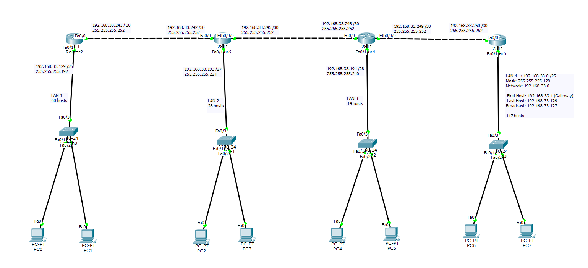

# VLSM Subnetting and Multi-LAN Network Design with RIP v2

## Overview

This project demonstrates the design and implementation of a scalable network using **VLSM (Variable Length Subnet Masking)** and **RIP v2 dynamic routing**.
The topology consists of multiple LANs connected through routers, optimized for efficient IP address utilization.

---

## Key Concepts Used

* VLSM Subnetting
* CIDR Addressing
* RIP v2 Routing Protocol
* Multi-router network design
* IP address optimization

---

## Network Design

* Designed multiple LANs with different host requirements
* Allocated subnet sizes efficiently using VLSM
* Connected routers using /30 subnets for point-to-point links
* Implemented RIP v2 for automatic route sharing

---

## Subnet Allocation

| LAN   | Subnet            | Mask            | Usable Hosts |
| ----- | ----------------- | --------------- | ------------ |
| LAN 4 | 192.168.33.0/25   | 255.255.255.128 | 126          |
| LAN 1 | 192.168.33.128/26 | 255.255.255.192 | 62           |
| LAN 2 | 192.168.33.192/27 | 255.255.255.224 | 30           |
| LAN 3 | 192.168.33.224/28 | 255.255.255.240 | 14           |

---

## Routing Configuration

* Protocol used: **RIP Version 2**
* Features:

  * Classless routing (supports VLSM)
  * Automatic route exchange
* Configuration:

```bash
router rip
version 2
no auto-summary
network 192.168.33.0
```

---

## Simulation Tool

* Cisco Packet Tracer

---

## Testing

* Verified connectivity using:

  * ICMP (ping)
* Successfully achieved end-to-end communication across all LANs

---

## Network Topology

> Add your image in the repository and update the filename below

```md

```

---

## Key Achievements

* Efficient IP address allocation using VLSM
* Proper segmentation of networks
* Successful implementation of dynamic routing
* Full connectivity across all nodes

---

## Repository Structure

```
├── topology.png
├── project.pkt
└── README.md
```

---

## Author

Md. Ekhtiar Hossain
Computer Science & Engineering Student
